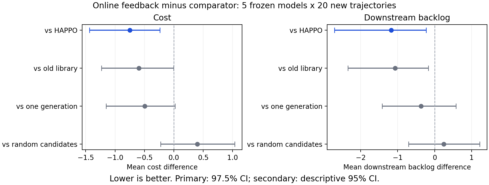

# 灾害冲击下多级物资补给：冻结HAPPO与实时LLM修正

本项目基于Liu等的多级库存代码，将三级补货系统解释为灾区物资供应链，研究正常环境训练的HAPPO如何应对突发需求变化。当前主线是在HAPPO保持冻结的情况下，现场调用DeepSeek生成补货修正规则，通过因果需求预测与独立复核决定是否执行。

**最新状态（2026-10-04）：实时LLM独立确认已完成，代码、原始记录和审核报告已上传。本轮后台实验已结束，定时跟进已暂停。**

最新研究内容位于 [`codex/llm-current-v2`](https://github.com/Syh-dufe/zaiqu/tree/codex/llm-current-v2) 分支，尚未合并到 `main`。

## 最新实验结果

冻结5个HAPPO训练模型，使用20条新需求路径，比较5种方法在正常与冲击情形下的表现，共1000回合、600000节点期。全部模型、路径、失败与退化案例保留；测试成绩未用于修改本版提示词。

以下为100个模型×冲击路径配对的平均值，成本与欠货均越小越好。

| 方法 | 平均成本 | 下游平均欠货 |
|---|---:|---:|
| 纯HAPPO | 20.64612 | 18.87710 |
| 旧LLM库＋筛选 | 20.49102 | 18.77215 |
| 实时一次生成＋筛选 | 20.39315 | 18.06440 |
| 实时LLM反馈＋筛选 | 19.89710 | 17.69955 |
| 随机候选＋同一筛选 | 19.49662 | 17.45165 |

实时反馈相对纯HAPPO平均成本降低 **3.63%**、欠货降低 **6.24%**。两项差异的预登记97.5%交叉重采样区间均低于零，达到本协议的整体改善标准。全部5模型的两项平均差异均为负，但100个配对中34个至少一项退化。

**结论边界：随机候选配合同样筛选的平均成绩更好；实时LLM相对随机的两项描述性区间均跨零。目前支持整套在线修正机制改善冻结HAPPO，尚不能证明LLM候选来源优于随机搜索，也不能称LLM为全部对照中的最佳。** 多轮反馈相对一次生成的两项区间也跨零，独立反馈贡献尚未确认。

- [完整独立确认报告](docs/2026-10-04-online-llm-confirmation-results.md)
- [预登记确认协议](docs/superpowers/plans/2026-10-04-online-llm-confirmation.md)
- [因果、模型冻结与API审核](docs/2026-10-04-online-confirmation-causal-review.md)
- [原始统计独立复算](docs/2026-10-04-online-confirmation-statistical-review.md)
- [全部确认产物与导出哈希](docs/artifacts/online_llm_confirmation_v1/)
- [首批小型开发结果](docs/2026-10-04-online-llm-development-v1-results.md)



图中负值表示实时反馈更好。主比较为97.5%区间，其余为描述性95%区间；[PDF版本](docs/figures/online-llm-confirmation-differences.pdf)。

## 场景与模型假设

| 原库存模型节点或变量 | 灾区业务解释 |
|---|---|
| 上游节点 | 物资供应中心 |
| 中间节点 | 区域物资仓库 |
| 下游节点 | 社区物资供应点 |
| 订货量 | 向上游申请补充的标准批次 |
| 库存 | 尚未发放的储备物资 |
| 欠货 | 允许后续补供的未满足需求 |

数量和时间为归一化批次与仿真期。保留作者三级库存状态转移：初始库存10、提前期4、订货动作0—20、单位库存/欠货成本1、无固定订货成本。HAPPO使用正常Merton需求训练，后续冲击评估不重新训练。

当前冲击为需求倍率1.25或1.5，经取整并截断至20；k=3报告只提供已完成3期的需求汇总，可靠通知在冲击发生两期后可用。LLM不读取隐藏需求或实际事件起止、倍率。实际需求增幅单独记录，不能用名义倍率代替。

这是灾区物资补给的抽象仿真，尚无车辆、道路损毁、真实灾区数据校准或现场验证。当前结果也不能单独确认灾情特异适应、虚假通知鲁棒性或现实响应时限。

- [模型假设与参数来源](docs/2026-10-03-model-assumptions-and-sources.md)
- [定期需求报告与信息边界](docs/2026-10-03-periodic-demand-reports.md)

## 实时LLM机制

1. 冻结HAPPO给出原始补货动作。
2. 通知后现场调用DeepSeek，依据当前状态和已送达报告生成3个候选修正规则。
3. 使用3条合成需求路径进行搜索预测，允许一次预测反馈修订，替换候选0。
4. 使用另外3条路径独立复核；预测成本需改善至少1%，下游欠货不能增加，否则回到HAPPO。
5. 每5期重新筛选，最多4次生成事件；每回合最多16次HTTP请求，记忆在回合结束后清空。

本机制不微调DeepSeek权重，不为每条测试灾情提前训练规则。回合内在线反馈与跨场景离线开发分别记录；独立确认不向开发提示优化反馈成绩。

本批实际1069次HTTP请求、3846430 tokens，保存91次格式失败记录。11次初始生成在修复后仍失败，采用零修正候选；无规则执行回退。同步API超时和实测墙钟不构成现实救灾截止时间保证，实际账单金额未取得。

- [实时方案初稿](docs/superpowers/plans/2026-10-04-online-llm-draft.md)
- [实施清单](docs/superpowers/plans/2026-10-04-online-llm-implementation.md)
- [方法文献与借鉴范围](docs/2026-10-04-online-llm-literature.md)

## 代码入口与产物

| 入口 | 用途 |
|---|---|
| `scripts/setup_upstream.py` | 获取固定作者源码到本地 |
| `experiments/emergency_compatibility/train.py` | 原规则的灾区业务解释兼容训练入口 |
| `experiments/learning_curve/run.py` | 记录训练曲线、稳定性与检查点 |
| `experiments/formal_evaluation/train_multi.py` | 多训练种子驱动 |
| `experiments/online_llm/run.py` | 4条路径、单模型的实时LLM评估 |
| `experiments/online_llm_confirmation/batch.py` | 冻结登记与25子任务独立确认驱动 |
| `experiments/online_llm_artifacts/archive_confirmation.py` | 完成结果审核与无损归档，不调用API |
| `experiments/online_llm_artifacts/plot_confirmation.py` | 从确认汇总生成PNG/PDF差异图 |

本地训练记录位于 `results/learning_curve/`，实时确认位于 `results/online_llm/confirmation_v1/`。公开归档在 `docs/artifacts/`，包含输入、冻结源码快照、请求/回复、失败、筛选、回合及压缩节点期；模型权重和API密钥不上传。

归档中的绝对路径是原执行环境的来源记录，换机器时需配置对应本地模型与输入。仅克隆仓库不能直接重新调用API完成整套实验。入口拒绝覆盖已登记或已启动输出；已用确认路径不得再作为新方法的未见测试。

## 环境与准备

- [Liu官方仓库](https://github.com/xiaotianliu01/Multi-Agent-Deep-Reinforcement-Learning-on-Multi-Echelon-Inventory-Management)
- 作者固定提交：`a7e5a3e83e21565a5799483bc534e39635ec65dd`
- [正式论文](https://doi.org/10.1177/10591478241305863)

执行环境使用Python3.12.13、PyTorch2.14.1+cpu、NumPy1.26.4；作者README说明Python3.8。版本差异与冻结摘要保留在归档，不将不同依赖环境称为完全相同复现。活动作者检出位于本地 `external/liu-inventory`；公开审计产物也包含固定源码快照，其来源不应误认成本项目原创实现。

在仓库根目录准备本地作者源码，并查看兼容入口说明：

```powershell
python scripts/setup_upstream.py
python experiments/emergency_compatibility/train.py --describe
```

实际训练与评估需要另行准备兼容依赖和本地模型。实时评估的密钥从环境变量 `DEEPSEEK_API_KEY` 读取；不写入代码、提示文件或Git。运行参数、预检及预算以对应协议和脚本帮助为准。

## 历史实验与后续工作

各阶段使用不同数据和协议，历史开发收益不能代替当前独立确认。

- [官方入口兼容与训练稳定标准](docs/2026-10-03-training-until-stable.md)：种子11、13达到登记经验稳定标准；12、14、15因原始早停结束，不能称收敛，全部保留。
- [阶段A单模型固定库实验](docs/formal-evaluation-stage-a-results.md)
- [多训练种子与消融B/C](docs/formal-evaluation-bc-results.md)：已完成，替代早期“尚未执行”的状态。
- [旧固定LLM库独立测试](docs/2026-10-03-llm-library-confirmation-results.md)
- [当前环境离线迭代v2](docs/2026-10-04-llm-current-v2-results.md)
- [反思演化v3](docs/2026-10-04-llm-evolution-v3-results.md)
- [协调父代v4](docs/2026-10-04-llm-coordinated-v4-results.md)

后续重点是区分LLM候选内容、预测筛选及额外信息各自的贡献，并验证不同突发变化、通知可靠性和计算开销。若改进机制，将本批路径登记为已用数据，使用新的未见路径确认；不通过删种子、削弱对照或反复同测试优化来制造优势。
