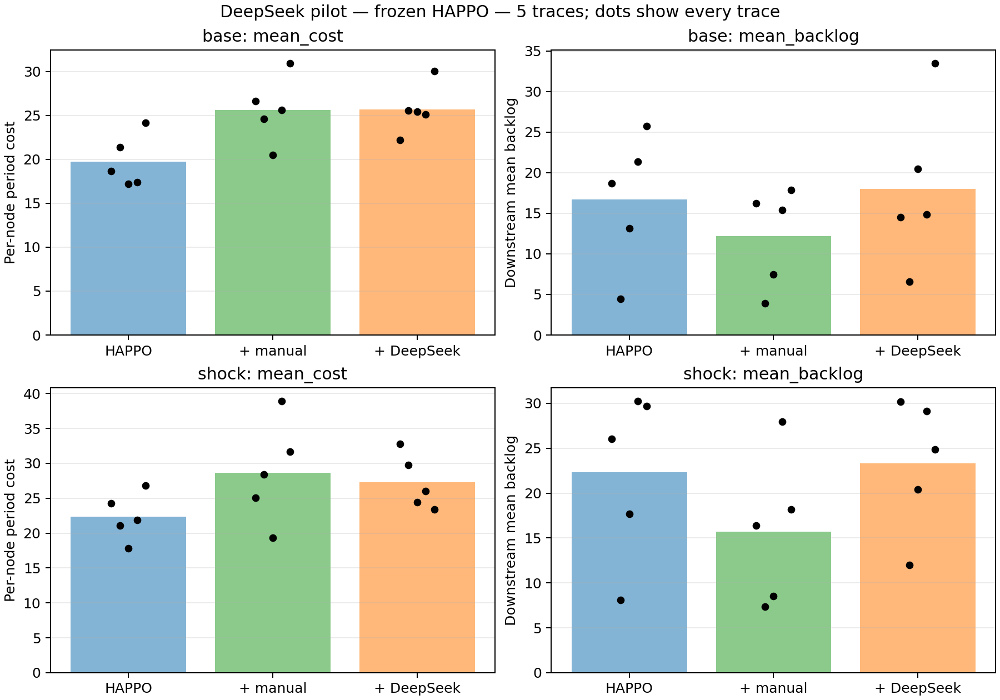

# DeepSeek + 冻结 HAPPO：第一轮小实验

## 结论

接口及动作修正流程已运行，HAPPO未重训，但本轮没有支持 DeepSeek 规则改善灾区应对的结论。正常波动触发了全部5个正常回合的告警；全部5个冲击回合的告警也早于设定事件。DeepSeek在本轮生成规则时尚未看到事件造成的需求变化。

本轮按[预先固定协议](2026-10-03-deepseek-pilot-plan.md)完整执行并保留结果，没有修改检测阈值、重新生成挑选规则或删除失败情形。它是一轮接口和方法开发实验，不宜作为论文中“灾后现场生成规则有效”的证据。

## 实验与接口

5条新Merton需求，种子20261005；随机事件种子20261006。各条分别正常/冲击，每情形200期；三组共30回合，18,000条节点期记录。只使用250,000步冻结模型。

账户模型列表显示 deepseek-flash = DeepSeek-V4.1-Flash，另有deepseek-v4-pro；本轮请求及响应标识均为deepseek-flash。使用非思考模式、temperature=0.2、JSON输出；别名不是永久固定权重的保证。10次生成请求均返回可解析、合法表达式规则，运行时规则失败0次，训练更新0次。

请求累计耗时18.982秒，总用量10,415 tokens。这是接口计量，不是美元账单；没有推断实际收费。仿真在请求期间暂停，不能把结果解释为已计入现实业务等待损失。密钥仅从环境读取，已检查所有JSON/CSV产物不含密钥。

## 所有情形的平均表现

每节点、每期平均成本越低越好；下游积压为发放点平均未满足物资量。每个表格均值含全部5条需求。

| 组别 | 正常成本 | 冲击成本 | 正常下游平均积压 | 冲击下游平均积压 | 冲击下游末期积压 |
| --- | ---: | ---: | ---: | ---: | ---: |
| 冻结HAPPO | 19.75367 | 22.39667 | 16.66600 | 22.34900 | 49.40000 |
| HAPPO+人工规则 | 25.65467 | 28.67200 | 12.17000 | 15.69100 | 33.60000 |
| HAPPO+DeepSeek规则 | 25.69233 | 27.28567 | 17.97700 | 23.30400 | 54.60000 |

人工规则在全部5条正常、5条冲击需求上减少下游平均积压，但成本都增加。DeepSeek在5条冲击需求中仅1条成本低于HAPPO，2条下游平均积压低于HAPPO；正常需求中0条成本降低、2条下游平均积压降低。所有逐条差异保存在paired_vs_happo.csv，不只报告有利案例。

下游积压降低不一定降低全系统成本，原成本还包括各节点库存及其他节点积压。因此这两个目标不能混称。两种规则均不能从本轮获得成本优势结论。

## 告警问题：已确认的原因

| 需求编号（0起算） | 首次告警期 | 实际冲击开始期 |
| --- | ---: | ---: |
| 0 | 50 | 92 |
| 1 | 45 | 79 |
| 2 | 46 | 93 |
| 3 | 27 | 96 |
| 4 | 65 | 94 |

三组及正常/冲击情形的首次告警时间相同。原检测器只比较最近5期与此前20期平均需求，相对增幅超过30%连续2次就触发。原Merton过程本身存在变化趋势和波动，独立重算正常历史确认这些条件已经成立。问题是这个阈值把正常需求趋势也定义成异常，未针对无事件情形校准；不是调用API时读取了未来需求。

由于告警发生在事件之前，同一需求的正常/冲击两次API请求内容完全一致，但分别生成了不同规则。这也意味着DeepSeek组的“冲击减正常”差异混入了生成随机性，不是同一条规则下的纯事件效应。规则相对同一冲击情形HAPPO的差异仍作为单次生成探索性结果保留。

## 规则与恢复诊断

规则包装仅解释有限表达式，不执行模型生成的任意Python。每节点修正限制[-6,6]，最终动作0..20。输入为当前库存/积压/在途、历史需求、当前HAPPO建议，没有未来需求、完整情形标识或事件表。三节点观测被中央包装汇集，人工规则有相同可用信息；这比单个分散actor多了中央协调，论文需披露。

DeepSeek生成的规则既增加也减少订单。在冲击情形中，每条回合平均有62.4个节点期增加订单、121.4个节点期减少订单。它说明存在较多削减，但仅凭计数不能断言这是退化的唯一原因。解释文本只是模型对规则的描述，效果以仿真记录为准。

恢复记录以各组自己的正常情形作参照，保存首个10期额外积压<=5窗口、窗口后再次超阈以及直到期末持续不超阈的窗口。HAPPO有2条、人工规则1条、DeepSeek2条未观察到持续窗口。DeepSeek的正常/冲击规则分别生成，故其恢复值仅作诊断，不能当作严格配对的事件恢复能力证据。完整数据在recovery.csv。

## 核验、产物及下一步

原作者跟踪源码未改变，版本仍为a7e5a3e83e21565a5799483bc534e39635ec65dd。三组评估前后全部actor/critic摘要一致。核对30回合、每回合200期、各组触发一致、触发前动作/成本一致、动作边界、逐条均值和密钥未落盘，均通过。进程正常退出码0；PNG/PDF已生成并查看。

产物：[目录](artifacts/deepseek_flash_5cases_v1/)。包含需求与事件表、提示词、全部10次原始响应/规则/用量、逐期动作、全部指标和图。作者源码、模型和密钥未上传。



下一轮优先在独立的正常需求校准/验证集上检查误报，再在新的开发事件上评估检出率与延迟，确定告警协议。不能用本轮冲击时间直接替换告警或把阈值调到本轮有利。之后再进行规则接口及提示词的迭代，最终使用未参与开发的事件和多次生成评估。原模型保持冻结。

本轮已用完事先固定的10次调用预算，没有额外调用尝试制造改善。

## 复查

```powershell
python experiments/deepseek_pilot/run.py --run-name deepseek_flash_5cases_v1
python experiments/deepseek_pilot/summarize.py results/deepseek_pilot/deepseek_flash_5cases_v1
python scripts/plot_deepseek_pilot.py results/deepseek_pilot/deepseek_flash_5cases_v1
```

生成脚本需要进程环境中的DEEPSEEK_API_KEY，并拒绝覆盖已有结果。汇总/绘图不调用API，不需密钥。重新运行生成会产生新请求和费用，不能用重跑替代原始记录。
