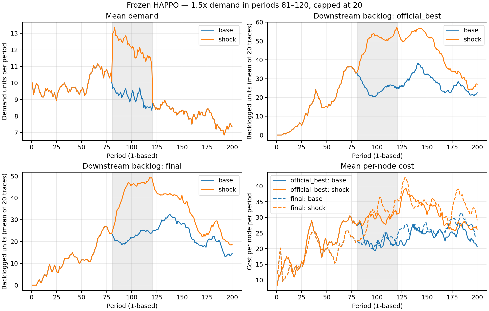

# 小型灾后需求突增仿真结果

按[固定协议](2026-10-03-demand-shock-plan.md)完成两份冻结 HAPPO 模型、20 条需求的无冲击/有冲击配对仿真。没有重新训练；原作者库存环境、状态更新、观测、动作和评估循环未修改。只将第 81..120 期外生需求映射为 min(20,ceil(1.5*d))，不将未来需求或冲击时间告知策略。

## 实际冲击与成本

原需求上限截断使冲击窗口总需求实际成为原来的 1.331918 倍，即增加 33.19%；27.75% 的窗口需求值存在严格截断。该设置是探索性需求冲击，未经真实洪灾数据校准。

| 指标 | 250,000步最佳模型 | 295,000步最终模型 |
| --- | ---: | ---: |
| 无冲击全周期平均成本 | 22.71575 | 22.71858 |
| 有冲击全周期平均成本 | 26.87425 | 27.37717 |
| 全周期成本增加 | 4.15850（18.31%） | 4.65858（20.51%） |
| 冲击窗口平均成本增加 | 7.15000 | 8.08167 |
| 无冲击窗口发放点平均积压 | 24.83625 | 22.08750 |
| 有冲击窗口发放点平均积压 | 49.67125 | 42.98375 |
| 有冲击后第121..200期发放点平均积压 | 42.76875 | 32.27625 |
| 无冲击后第121..200期发放点平均积压 | 27.61063 | 23.12875 |
| 各轨迹全周期峰值积压的平均增量 | 24.80000 | 22.10000 |
| 有冲击末期发放点平均积压 | 27.05000 | 18.60000 |
| 无冲击末期发放点平均积压 | 22.50000 | 14.50000 |

成本为每节点、每期平均成本；积压单位为原模型中的标准物资批量。没有把积压换算成丢单率或准时满足率。

## 恢复：首次缓解不等于持续恢复

预先固定的恢复指标是第121期后首个连续10期“冲击积压 <= 配对无冲击积压 +5”的窗口。两模型均有19条轨迹观察到这样的窗口，各有1条（0起算 trace=5）直到200期仍未观察到完整窗口，记为右删失而不是赋一个人为恢复时间。

在观察到窗口的19条轨迹中，最佳模型的首次窗口平均延迟14期、最长67期；最终模型为10.63期、最长56期。这些均值排除右删失轨迹，不能解释为全部20条需求的平均恢复时间。更重要的是，两模型各有14条轨迹在首个窗口结束后再次超过“配对无冲击 +5”的界限。因此本轮的指标只能表示首次局部缓解，不能宣称19条轨迹已经永久恢复或清空积压。

两份模型存在成本和下游积压的不同表现；当前不是不同算法间的比较，也不根据压力结果重新挑选或训练模型。

## 核验与产物

- 无冲击结果精确复得上轮新需求均值；两种情形第1..80期逐值记录完全一致。
- 评估前后全部 actor/critic 参数摘要保持不变，与原250,000和295,000步快照相符；训练更新数为0。
- 输出48,000条节点期记录、40条配对轨迹指标；独立从CSV重算成本及所有恢复窗口、右删失和再次超阈轨迹，均与结果相符。
- 作者仓库固定版本 a7e5a3e83e21565a5799483bc534e39635ec65dd，跟踪源码无改动。进程退出码0，PNG/PDF已生成并查看。

全部需求、逐期记录、配对指标、独立核验和图：[产物目录](artifacts/shock_1p5_period81_120_v1/)。模型及日志保留本地。脚本：[run.py](../experiments/demand_shock/run.py)、[plot_demand_shock.py](../scripts/plot_demand_shock.py)。



## 解释和下一步

需求突增造成成本与发放点积压增加，冲击结束后仍有残留影响。模型在原需求上经验稳定，并不保证灾区压力下服务良好。这一结果可以用于定位后续补货规则需要改善的环节，而不是证明 HAPPO 有优势。

本轮是单训练种子、20条已用于开发观察的需求、单强度冲击；不是真实洪灾配送验证或最终独立测试。下一步可先查看高积压及未恢复轨迹，检查各节点补货动作和在途状态，再预先定义小型补货修正规则的对照。LLM规则、重新训练和基线排名均未加入本轮。

复查命令（已有结果目录会拒绝覆盖）：

```powershell
python experiments/demand_shock/run.py --run-name shock_1p5_period81_120_v1
python scripts/plot_demand_shock.py results/demand_shock/shock_1p5_period81_120_v1
```
