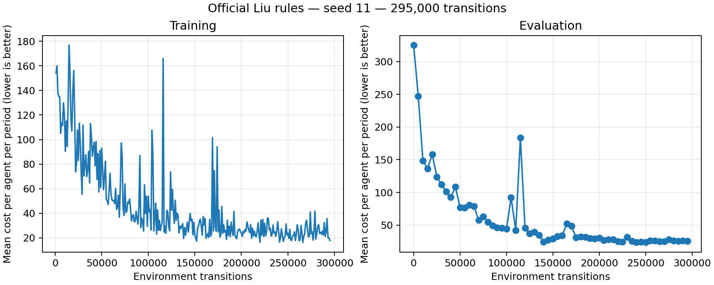

# HAPPO 单种子经验稳定训练结果

## 结论与范围

种子 11 在 295,000 环境转移步触发预先固定的经验稳定标准，训练正常停止。开始时间约 2026-10-03 15:12:48，最后快照约 15:56，北京时间，总耗时约 43 分钟。预算上限 3,000,000 步并未用尽；停止原因是经验平台，不是预算耗尽或原无改善早停。

沿用 Liu 原库存环境、需求、奖励和更新方法。作者仓库版本 a7e5a3e83e21565a5799483bc534e39635ec65dd，已确认跟踪源码无改动。唯一实验种子为 11；采样轨迹 5 条，评估为原 20 条需求，原无改善耐心从 10 调到 40。当前业务解释是三级应急物资补货；未加入洪灾冲击、车辆配送或 LLM。

这证明当前种子在固定评估集合上达到经验稳定标准，不能证明全局最优、跨种子稳定或优于其他算法。没有进行基线排名。

## 成本与判据

成本为每个节点、每期的平均成本，越低越好。

| 检查点 | 评估成本 |
| --- | ---: |
| 初始 | 324.88675 |
| 5,000 步 | 247.09125 |
| 50,000 步 | 77.20650 |
| 250,000 步，官方保存的最佳模型 | 23.71875 |
| 295,000 步，最终模型 | 25.38592 |

按去除初始评估及额外最终重复评估后的定期评估独立重算，相邻两组各十次评估满足：

| 指标 | 实测 | 预定上限 |
| --- | ---: | ---: |
| 中位数绝对相对变化 | 0.90327% | 1% |
| 最佳成本绝对相对变化 | 0.04916% | 1% |
| 最近十次成本变异系数 | 4.02757% | 5% |

训练步数超过最低 100,000 步，三个条件同时满足。未调整阈值或更换种子。

## 反弹及产物核验

曲线不是单调改善：105,000 步成本反弹至 91.96992；最大相邻评估反弹发生于 115,000 步，从 42.14142 上升至 183.28717（约 +334.93%）。完整反弹列表保存在 completion_audit.json，完整曲线保留全部评估和训练记录。最终成本比 250,000 步最佳模型高，两个模型分别保留。

已加载三节点各自的 actor 和 critic 参数文件，按全部参数摘要核对：官方 models 与 250,000 步快照相同；final_models 与 295,000 步快照相同。训练结束时重新建立策略对象加载最终模型，最大参数误差为 0。5,000 和 50,000 步的参数摘要分别与此前兼容验证、短预算训练一致。

原始 stability.json 在停止后的额外最终评估时被再次写入，包含重复的最后一个观测，因此显示 false。该文件原样保留。真正用于停止的 completed.json.stability 为 true，独立去除额外重复评估重算后完全一致，见 completion_audit.json。不能用含重复末尾观测的状态文件替代停止时判据。

## 可复查记录

记录和 PNG/PDF 图保存在 [完整产物目录](artifacts/curve_seed11_until_stable_v1/)。模型文件及训练日志仍保留在本地 external/results 和 results 目录，未上传作者源码或模型。

本轮固定协议已完成。后续可使用已核验的最佳模型开展新增业务设定；若改变环境或训练目标，需要单独设计新实验，不能把本轮稳定结论直接推广到新场景。
