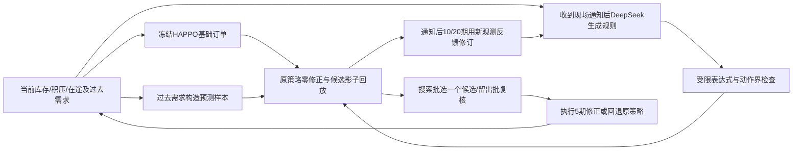

# 当前LLM与冻结HAPPO的接口及可声明范围

## 原模型保持的部分

作者环境的三级串行流动、欠单结转、4期提前期、0..20订货、库存与缺货成本、HAPPO网络和顺序更新均保留。当前只在评估时包裹动作；使用种子11、250000步的最佳检查点，没有在冲击情形继续训练。

业务解释是供应中心—区域仓库—社区物资点，需求冲击代表发放需求短时上升。当前不涉及车辆路线、道路封闭、多仓库网络或真实灾情校准。

## v3计算方法

对每个当前HAPPO订单u，规则修正delta先截断[-6,6]再四舍五入，最终订单clip(u+delta,0,20)。JSON表达式由受限AST解释器运行，不执行模型生成的任意Python。

预测每次重新生成6条路径：最近5期需求均值加从最近20期中心化需求中抽取的残差，四舍五入截断0..20；3条搜索、3条复核，各组采用相同预测随机种子。它是简单经验预测，并未证明覆盖真实未知需求，也不等于作者Merton生成器的条件分布。

影子窗口H=min(20,200-当前已观察期数)。候选只执行前5期，后续原HAPPO继续响应影子状态；真实控制每5期重新评分，因此后续原策略是预测假设。复制Actor在处理当前观测后返回的RNN状态，用当前基础订单作为影子第一步，之后重新调用原Actor；避免重复处理同一个当前观测。

影子目标C为H期所有节点库存+积压之和的3路径平均；服务指标S为H期下游积压之和的平均。零修正始终参评。搜索中C候选<=0.99*C零且S候选<=S零才可选，按C最小选一个；复核批同样通过才执行，否则回退零修正。不选择真实后续成绩最好的候选，也不在复核失败后循环试到通过。

初始一次请求生成3条候选；迭代组在通知后10/20期分别以新观测、当前搜索预测分数修订1条。原有候选仍保留。单次组固定使用初始第1条，人工组固定使用已有人工补货规则，各自采用相同筛选流程。

## 写作时需区分的贡献

- 原HAPPO来自作者，不是本项目的算法创新。
- 通知是新输入假设，本轮不等于仅从需求自动识别灾情。
- LLM与筛选拥有额外全局状态与算力；人工组用于检查这类额外资源是否已足够。
- 迭代组与单次组的候选数、调用时点和预算不同，结果不能仅归因于LLM反馈。需要等候选数/去反馈等消融后才支持更强贡献判断。
- 训练模型冻结，但规则进行了在线适配，不能声称整个系统没有适配。
- 仿真暂停等待API及评分，记录的耗时不等于部署时需求继续到达下的效果。
- 小试、调参需求与独立测试分开保留；即使确认实验改善，也仅覆盖当前需求分布和单训练种子。

论文数值应以完整20条确认报告为准，不挑选之前成功的2条或4条代替全部确认结果。
