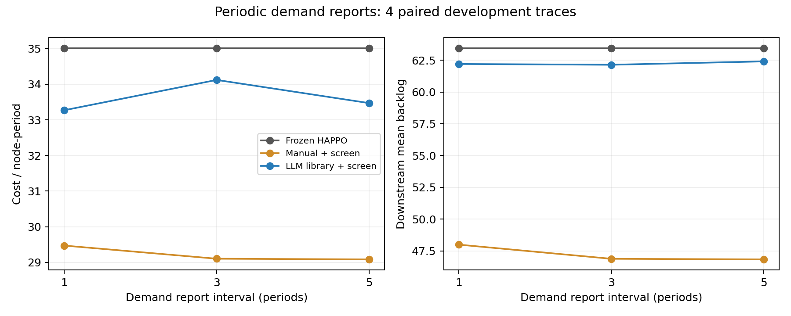

# 定期需求报告：小型开发实验结果

相同4条新需求轨迹，报告间隔1、3、5周期；3方法及正常/突发情形，共72回合。冻结HAPPO，API请求0，训练更新0。三档共享4条轨迹，不能当作12条独立样本。

| 上报间隔 | 方法 | 平均系统成本/节点周期 | 下游平均积压 |
|---:|---|---:|---:|
| 1 | Frozen HAPPO | 35.0037 | 63.4175 |
| 1 | Manual + screen | 29.4717 | 47.9988 |
| 1 | LLM library + screen | 33.2700 | 62.1975 |
| 3 | Frozen HAPPO | 35.0037 | 63.4175 |
| 3 | Manual + screen | 29.1029 | 46.8875 |
| 3 | LLM library + screen | 34.1208 | 62.1363 |
| 5 | Frozen HAPPO | 35.0037 | 63.4175 |
| 5 | Manual + screen | 29.0833 | 46.8387 |
| 5 | LLM library + screen | 33.4704 | 62.4025 |

## LLM相对原HAPPO

- 1周期：成本变化-4.95%，积压变化-1.92%；成本改善/退化/持平4/0/0，积压改善/退化/持平4/0/0。
- 3周期：成本变化-2.52%，积压变化-2.02%；成本改善/退化/持平3/1/0，积压改善/退化/持平4/0/0。
- 5周期：成本变化-4.38%，积压变化-1.60%；成本改善/退化/持平4/0/0，积压改善/退化/持平4/0/0。

## 核查与限制

- 三档真实需求和事件完全一致，原HAPPO逐回合结果一致；正常情形三方法一致。
- 共14400次决策的信息记录核对完成；重建历史只覆盖已送达报告区间，报告总量与真实历史汇总一致。
- 三档源代码/库哈希一致，各方法模型哈希不变；原策略影子回放审计完成，无记录的运行失败。
- 人工对照固定3档修正强度，与3条LLM规则同候选数；该人工对照与旧实验的单候选不同。
- 信息间隔同时带来滞后与区间平滑，不能把差异全部解释成延迟效应。
- 即时库存、积压、本地订单和HAPPO建议仍可见；这不是全系统信息延迟。可靠灾情通知仍保留。
- 预测报告均值视作近似潜在需求、待上报过去片段以最后均值填充；不声称精确贝叶斯后验。
- 仅4条开发轨迹和1个冻结模型，不作显著性或普遍最优结论，也不用于真实洪灾部署结论。
- 仿真在预测计算时暂停，运行耗时不是实时部署吞吐性能。

全部逐轨迹差异和原始信息记录（大文件gzip压缩）见 [产物目录](artifacts/periodic_reports_development_v1/summary.json)。

