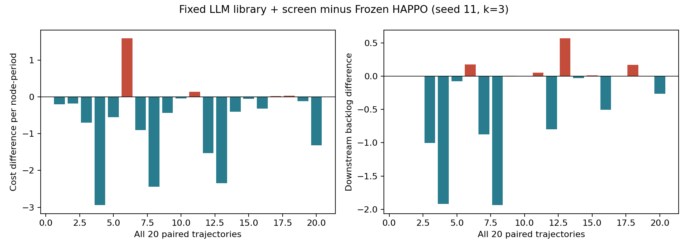
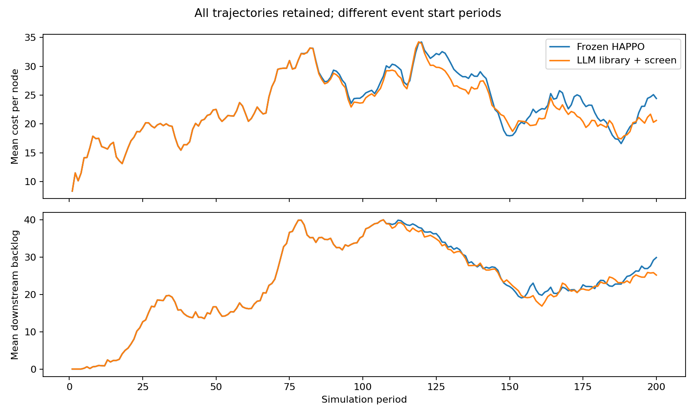

# 阶段A：20条新需求、80回合正式确认

按固定协议完成全部5批；单个seed11模型，报告间隔3，固定LLM算子库，评估阶段无API、无训练。

| 方法 | 平均成本/节点期 | 下游平均积压 |
|---|---:|---:|
| Frozen HAPPO | 23.3819 | 23.4155 |
| LLM算子库+筛选 | 22.7494 | 23.0945 |

成本均值下降2.71%，下游积压均值下降1.37%；下降为负表示退化。

| 配对差：方法减HAPPO | 均值 | 95%区间 | 97.5%区间 | 改善/持平/退化 |
|---|---:|---|---|---|
| cost | -0.6325 | [-1.0919, -0.1933] | [-1.1565, -0.1313] | 16/0/4 |
| backlog | -0.3210 | [-0.6255, -0.0548] | [-0.6757, -0.0213] | 9/5/6 |

两项均值及各97.5%区间上限均低于0，达到预定的本分布下平均改善证据标准。

20条中两指标都严格改善9条。多训练种子和机制消融尚未运行。

正常需求两方法均为成本22.2533、下游积压20.4690。完整方案与原HAPPO的平均总成本分别为13649.65、14029.15；总成本为归一化均值乘600。

## 口径与限制

- 基准需求未受冲击时，两方法所有行为相同，不把40个正常回合加入冲击配对统计。
- 每条配对是统计单位，20000次bootstrap、种子20261220；97.5%区间对应两指标Bonferroni名义家族95%，有限样本覆盖不是严格保证。
- 原HAPPO本地信息与修正模块全节点状态/滞后汇总不完全相同。结果评价完整系统，不能单独归因于LLM。
- 事件期在线选择已有LLM算子，并非实时API推理；可靠通知、均值重建报告、固定提前期、单类可补供物资假设均保留；没有真实洪灾数据校准。
- 预测结果不能保证每条真实轨迹改善。所有退化、截断比例、峰值/末期欠货及恢复期欠货见逐条数据。
- 筛选483次，非零采用88次，累计筛选180.52秒；总墙钟252.16秒。计算期间仿真暂停，不是实时时延实测。
- 当前评估API为0，但此前改进/发现系列有120次请求（含失败）。调用、修复来源与开发成本记录继续保留。

## 产物

- [完整统计](artifacts/stage_a_seed11_k3_v1_reviewed/summary.json)
- [全部20条配对](artifacts/stage_a_seed11_k3_v1_reviewed/paired.csv)
- [逐批输入、版本与因果审核](artifacts/stage_a_seed11_k3_v1_reviewed/verification.json)

